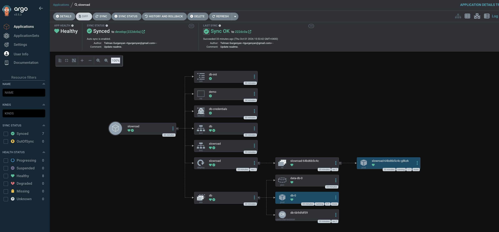

# devops-infra

Kubernetes infrastructure for the **Slow Road Armenia** app + PostgreSQL, deployed with
Kustomize and reconciled by Argo CD. Currently targets a local minikube cluster;
Terraform and cloud environments are planned.

## Layout

```
cluster/minikube/start.sh         Provision the local cluster, install Argo CD, hand over the app
argocd/apps/slowroad.yaml         Argo CD Application (tracks k8s/overlays/local on develop)
k8s/base/                         Kustomize base
├── kustomization.yaml            Resource list pulled in by the overlay
├── namespace.yaml                Namespace: demo
├── postgres/                     StatefulSet + headless Service + credentials Secret
│                                 + db-init ConfigMap (citext extension)
└── slowroad/                     Deployment + Service
k8s/overlays/local/               Local overlay
└── kustomization.yaml            Points at ../../base, adds env=local labels
docs/images/                      Screenshots used in this README
```

## Requirements

- Docker
- minikube
- kubectl (with kustomize support)
- helm (used to install Argo CD)

## Setup

Admin credentials for the app are read from a local `.env` file that is **not** committed.
Copy the example and fill it in before the first run:

```bash
cp .env.example .env
# ADMIN_EMAIL=...
# ADMIN_PASSWORD=...
```

## Usage

```bash
./cluster/minikube/start.sh
```

The script:

1. starts the `devops-infra` minikube profile (2 CPUs, 7Gi, Kubernetes v1.35.1),
2. creates the `demo` namespace and the `slowroad-app` Secret from `.env`,
3. installs Argo CD via Helm into the `argocd` namespace,
4. applies `argocd/apps/slowroad.yaml` so Argo CD syncs `k8s/overlays/local`,
5. waits for the `db` StatefulSet and `slowroad` Deployment to roll out,
6. prints the Argo CD admin password and port-forwards the UI to <https://localhost:8085>,
7. port-forwards the app to <http://localhost:8084> and stays in the foreground.

Override the ports with `LOCAL_PORT=9090 ARGOCD_PORT=9091 ./cluster/minikube/start.sh`.

Manual deploy against an existing cluster (bypassing Argo CD):

```bash
kubectl apply -k k8s/overlays/local
kubectl -n demo get pods
```

Teardown:

```bash
minikube delete --profile=devops-infra
```

## Components

| Workload | Image | Notes |
| --- | --- | --- |
| `db` (StatefulSet) | `postgres:15-alpine` | Headless Service on 5432, 1Gi volume from a `volumeClaimTemplate`, `pg_isready` startup/readiness/liveness probes, `db-init` ConfigMap mounted at `/docker-entrypoint-initdb.d` to enable the `citext` extension |
| `slowroad` (Deployment) | `ghcr.io/telmanarm/slowroad-armenia:latest` | Single replica on container port 8080, exposed by the `slowroad` Service on port 80. Connection string built from the `db-credentials` Secret; admin login from the `slowroad-app` Secret; HTTP probes on `/` |

## GitOps

`argocd/apps/slowroad.yaml` points Argo CD at this repository (`develop` branch,
`k8s/overlays/local`) with `prune` and `selfHeal` enabled. After the cluster is up, changes
pushed to `develop` are applied automatically — manual `kubectl apply` is only for
bootstrapping or for a cluster without Argo CD.



*The `slowroad` Application after a sync — every resource in `k8s/overlays/local` reconciled
from the `develop` branch.*

## Notes

- `k8s/base/postgres/secret.yaml` holds plaintext development credentials and is intended
  for local use only. Replace it with a sealed/SOPS-encrypted secret or an external secret
  store before any shared environment.
- The `slowroad-app` Secret is created imperatively by `start.sh` from `.env`, so it is not
  part of the Kustomize base and Argo CD does not manage it. A fresh cluster needs `.env`
  present, otherwise the app pod will not start.
- `RunMigrations=true` is set on the app container; it only has an effect if the application
  itself runs migrations on startup.
- `init.sql` runs only on first boot, when the postgres entrypoint initialises an empty data
  directory. On a volume that already exists the extension is not added, so delete the `db`
  PVC (or enable `citext` by hand once) to pick it up.
